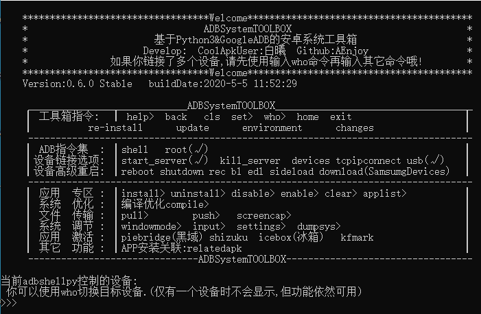

# This is the stable-building Version

How to use

```
git clone https://github.com/AEnjoy/adbshellpy.git
```

And then, running adbshell.py. Enjoy it!

你至少需要下载以下文件:

adbshell.py

adbshellpy_home.py

~~adbshellpy_libapkfile.py~~(dev)

adbshellpy_libhelper.py

# 功能介绍:0.6.0

adbshellpy是您的下一代Android玩机助手,需要Python3.6+

功能:

访问Android手机的终端shell

重启Android手机至特殊状态reboot shutdown rec bl edl sideload download

为Android手机安装/卸载/禁用/启用应用

查看您的Android手机所安装的应用

终端与PC之间传输文件push/pull

系统调节

模拟操作(input)

系统监控

系统截屏

黑域 shizuku  冰箱  快否激活

etc.

工具箱大小较小,支持自动下载所需功能(0.6.0始支持)



开发分支:https://github.com/AEnjoy/adbshellpy/tree/dev 包含所有最新的功能及改进

# ChangeLog:

```
0.6.0→0.6.1 2020-6-26 01:24:55
1.修复who不识别第三方REC的问题
2.compile可选择高级编译

0.5.4Beta→0.6.0Stable  2020-5-5 00:12:54
1.UI优化
2.修复崩溃问题
3.支持激活快否
4.一些小改进
5.支持激活冰箱
6.支持多设备切换:who指令
7.支持关联apk文件(实验性)
8.代码块拆分

0.5.3Beta→0.5.4Beta 2020-4-21 00:17:19
1.修复第一次运行adb不安装的bug
2.修复shell wm overscan闪退bug

0.5.2Beta→0.5.3Beta 2020-4-14 20:57:52
1.应用程序编译默认不载带-f参数

0.5.1Beta→0.5.2Beta 2020-4-10 23:06:45
1.添加功能:黑域,shizuku 激活

0.5Beta→0.5.1Beta   2020-3-29 15:46:54
1.修复了强制检测adb是否安装的bug
2.优化了部分输出内容
3.adb在下载前将会进行网络连通检测
4.默认直接进入主界面
5.添加了程序版本分支标记

0.4.2Beta→0.5Beta   2020-3-18 23:36:49
1.Bug修复
2.功能可用:pull/push
3.更新了QQ群加群链接
4.ReleaseToGitHub

0.4.1Beta→0.4.2Beta 2020-3-17 23:27:06
1.Bug修复
2.compile指令支持显示执行用时

0.4Beta→0.4.1Beta  2020-3-15 23:55:09 
1.使用exit退出时将自动清理adb服务
2.优化了help显示
3.命令行功能将暂不可用
4.更新链接替换至QQ群
5.支持显示changes
6.SET视图可用
7.UI部分优化(By:莫白)
8.screencap屏幕截图功能可用

0.3Alpha→0.4Beta   2020-3-13 00:25:33
1.帮助help更新
2.功能可用:dumpsys
3.修复了文件夹重命名失败导致安装失败的bug(玄学,修到一半自己好了TAT浪费感情(估计是权限问题),不过还是添加了相关代码)
4.修复了一处崩溃

0.2Alpha→0.3Alpha 2020年3月11日23:29:11
1.修复了一些导致崩溃的bug
2.帮助help更新
3.功能可用:settings

0.1Alpha→0.2Alpha 2020-3-11 
1.修复了一些导致崩溃的bug
2.修复了一些无关紧要的bug
3.功能可用:windowmode  input

0.1Alpha----
程序发布
```

